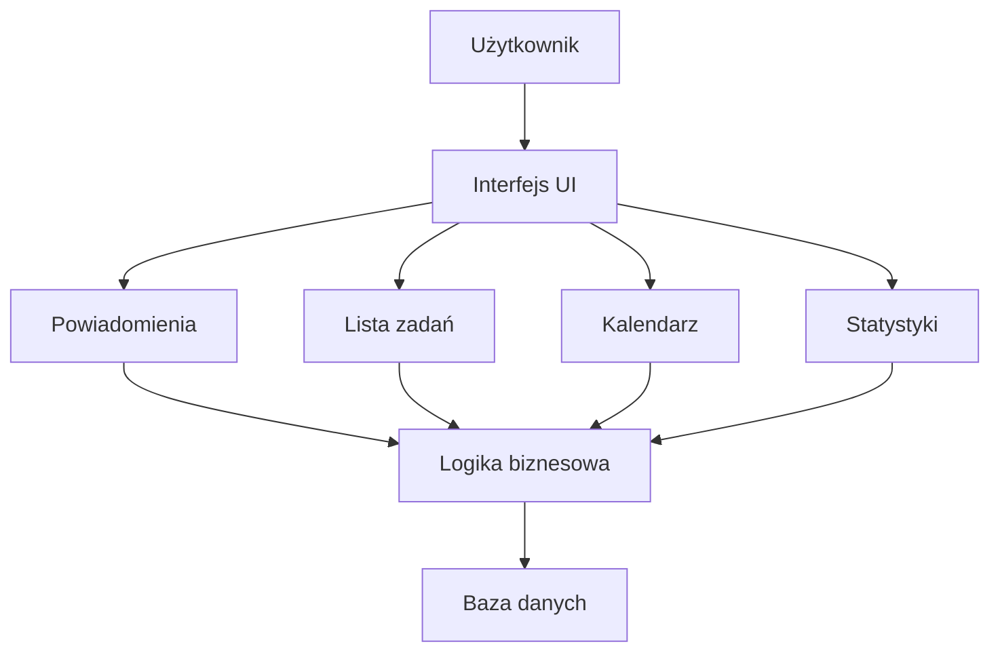

## Diagram działania aplikacji (flowchart)

Poniżej przedstawiono uproszczony diagram przepływu działania aplikacji do planowania nauki.

---

### Legenda

- **Użytkownik** – osoba w wieku 18–25 lat korzystająca z aplikacji  
- **Interfejs UI** – widoki: lista zadań, kalendarz tygodniowy, statystyki  
- **Powiadomienia** – przypomnienia o zadaniach i wydarzeniach  
- **Logika biznesowa** – reguły tworzenia i edycji zadań, harmonogramy, obliczanie statystyk  
- **Baza danych** – przechowywanie zadań, wydarzeń i ustawień użytkownika  

---

### Wersja graficzna (opcjonalnie)

Diagram może zostać w przyszłości zapisany jako plik graficzny (PNG/JPG/SVG)  
i dołączony do repozytorium jako osobny zasób dokumentacyjny.
